# 🏨 EL Hotel


A full-stack **Hotel Booking Web Application** built using the **MERN Stack** that allows users to search hotels,
book rooms, make secure online payments, receive email notifications, and manage bookings. Hotel owners can register hotels,
manage rooms, monitor bookings, create offers, and track booking statuses through an admin dashboard.

---

## 🌐 Live Demo

### 🌐 Frontend

👉 https://el-hotel-booking-app.netlify.app/

### ⚙ Backend API

👉 https://hotel-booking-app-5g3h.onrender.com

### 📂 GitHub Repository

👉 https://github.com/sdaabimanyu/Hotel-Booking-App

---

# 📖 Project Overview

EL Hotel is a modern hotel booking platform inspired by popular travel websites. It provides a seamless experience for travelers while giving hotel owners powerful management tools.

Users can:

- Register/Login securely
- Browse hotels
- Search available rooms
- Book rooms
- Pay securely using Stripe
- Track booking status
- Receive booking emails
- Get reminder notifications before check-in
- Save favorite hotels and rooms
- Review hotels after their stay

Hotel owners can:

- Register their hotel
- Manage rooms
- Track bookings
- Confirm or cancel bookings
- Check guests in/out
- Create promotional offers
- View booking dashboard

---

# 🚀 Key Highlights

- 🔐 Clerk Authentication
- 💳 Stripe Payment Integration
- 📧 Automated Email Notifications
- 🔔 Real-Time In-App Notifications
- ⭐ Hotel Reviews & Ratings
- ❤️ Favorite Hotels & Rooms
- 🎁 Hotel Offers & Discounts
- 🏨 Hotel Owner Dashboard
- 📅 Booking Status Tracking
- 🤖 Automated Daily Booking Reminders using GitHub Actions

---

## 📑 Table of Contents

- [Project Overview](#-project-overview)
- [Features](#-features)
- [Tech Stack](#-tech-stack)
- [Project Structure](#-project-structure)
- [Installation](#-installation)
- [Environment Variables](#-environment-variables)
- [Screenshots](#-screenshots)
- [Deployment](#-deployment)
- [Future Improvements](#-future-improvements)
- [Author](#-author)


---

# ✨ Features

## 👤 Authentication

- Clerk Authentication
- Secure Login
- Secure Registration
- Protected Routes

---

## 🏨 Hotel Management

- Register Hotel
- Update Hotel Information
- Upload Hotel Images
- Hotel Dashboard

---

## 🛏 Room Management

- Add Room
- Update Room
- Delete Room
- Room Availability
- Room Amenities
- Room Images

---

## 🔍 Search

- Search Hotels
- Search Rooms
- Filter Available Rooms

---

## 📅 Booking System

- Book Rooms
- Booking History
- Booking Status

Booking Status Flow

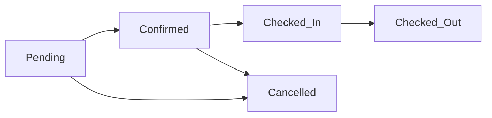

Cancelled can happen before Check-In.

---

## 💳 Payment

- Stripe Checkout
- Pay at Hotel
- Payment Success Tracking
- Stripe Webhook Integration

---

## 📧 Email Notifications

Users automatically receive:

- Booking Confirmation Email
- Payment Success Email
- Upcoming Booking Reminder Email

---

## 🔔 In-App Notifications

- Booking Created
- Payment Successful
- Special Offers
- Upcoming Booking Reminder

---

## ⭐ Reviews

- Add Review
- Hotel Rating
- Average Rating Calculation

---

## ❤️ Favorites

- Favorite Hotels
- Favorite Rooms

---

## 🎁 Offers

Hotel owners can

- Create Offers
- Set Discount Percentage
- Set Expiry Date

Users receive offer notifications.

---

## 📱 Responsive Design

Fully responsive for

- Desktop
- Tablet
- Mobile

---

# 🛠 Tech Stack

## Frontend

- React
- Vite
- Tailwind CSS
- Axios
- Clerk Authentication

## Backend

- Node.js
- Express.js
- MongoDB
- Mongoose
- JWT
- Nodemailer
- Stripe

## Deployment

- Netlify
- Render
- MongoDB Atlas
- GitHub Actions

---

# 📂 Project Structure

```
Hotel-Booking-App

client/
│
├── src/
├── components/
├── pages/
├── assets/

server/
│
├── controllers/
├── models/
├── routes/
├── middleware/
├── config/
├── utils/

```

---

# ⚙ Installation

## Clone Repository

```bash
git clone https://github.com/sdaabimanyu/Hotel-Booking-App.git
```

---

## Backend

```bash
cd server

npm install

npm run server
```

---

## Frontend

```bash
cd client

npm install

npm run dev
```

---

# 🔐 Environment Variables

Backend `.env`

```env
MONGODB_URI=

JWT_SECRET=

CLERK_SECRET_KEY=

STRIPE_SECRET_KEY=

STRIPE_WEBHOOK_SECRET=

SENDER_EMAIL=

EMAIL_PASSWORD=

CRON_SECRET=

CURRENCY=USD
```

Frontend `.env`

```env
VITE_CLERK_PUBLISHABLE_KEY=

VITE_BACKEND_URL=
```

---

# 💳 Stripe Payment Flow

```
User

↓

Create Booking

↓

Stripe Checkout

↓

Payment

↓

Stripe Webhook

↓

Booking Updated

↓

Payment Confirmation Email

↓

Payment Notification
```

---

# 📧 Automated Emails

The system automatically sends:

✅ Booking Confirmation

✅ Payment Receipt

✅ Upcoming Booking Reminder

---

# 🔔 Automated Notifications

The application automatically creates notifications for

- Booking Created
- Payment Successful
- New Offers
- Upcoming Stay Reminder

---

# ⏰ Automated Daily Reminder

GitHub Actions runs every day and automatically checks for bookings arriving the next day.

If eligible bookings are found:

- Reminder Email is sent
- Reminder Notification is created

---

# 📸 Screenshots

---

## 🏠 Home Page

<p align="center">
  
</p>

---

## 🏨 Hotel Listing

<p align="center">
  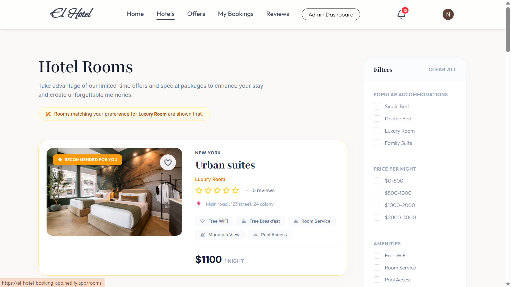
</p>

---

## 🛏 Room Details

<p align="center">
  
  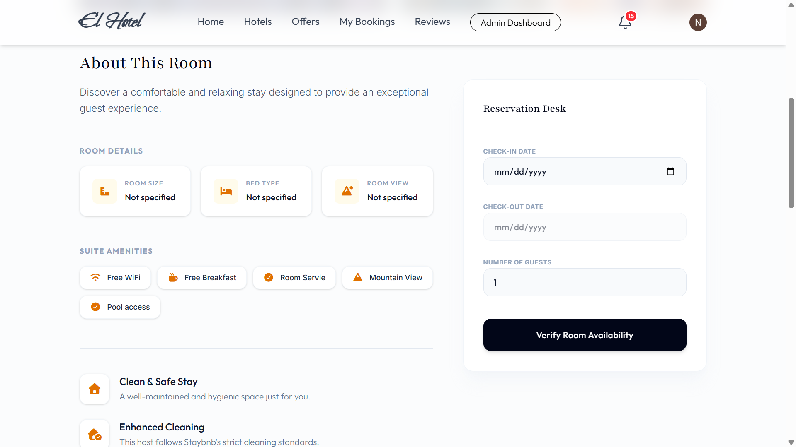
  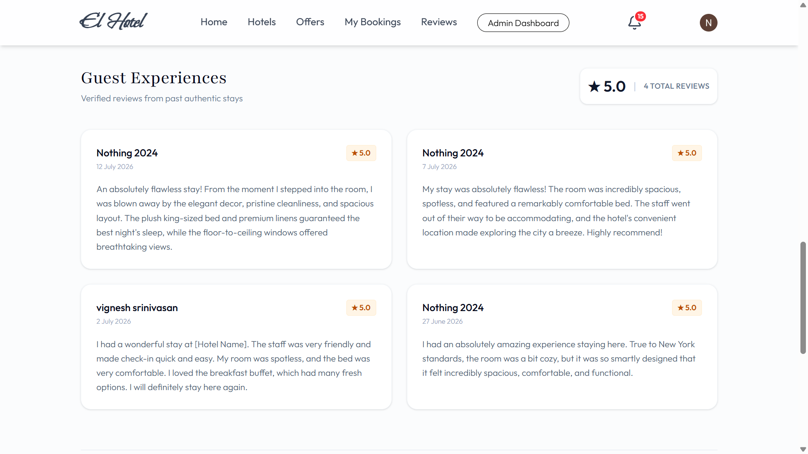
</p>

---

## 📅 Booking Process

<p align="center">
  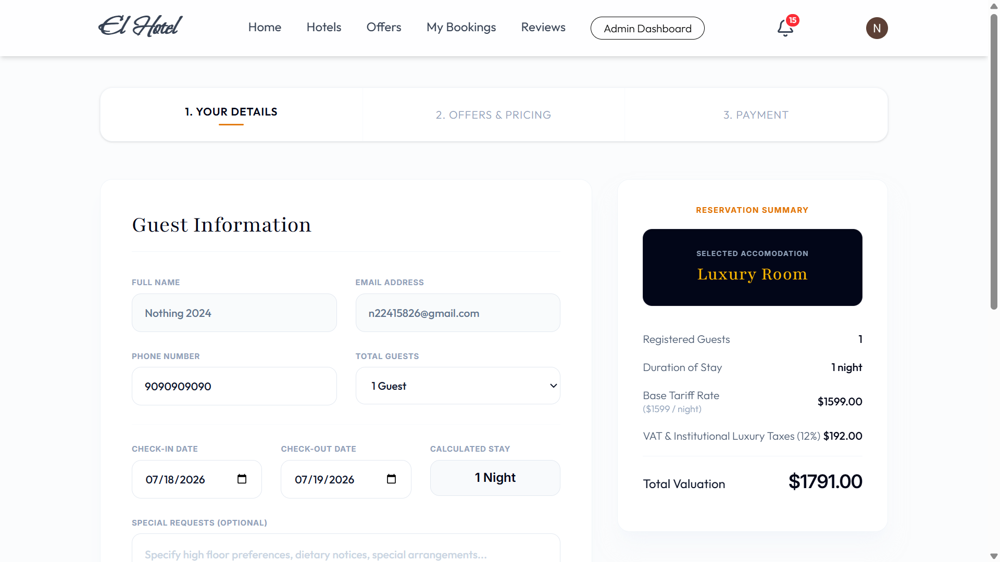
  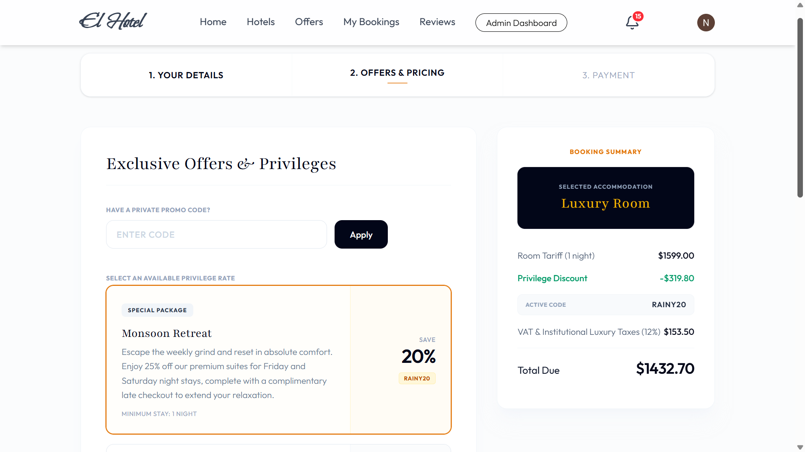
  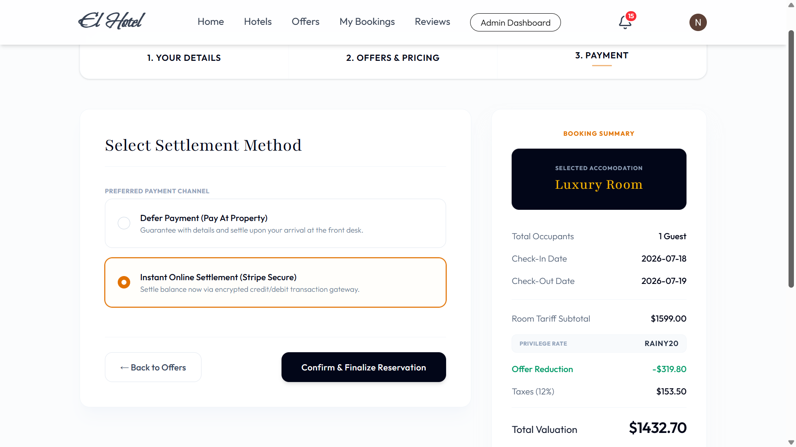
</p>

---

## 💳 Stripe Payment

<p align="center">
  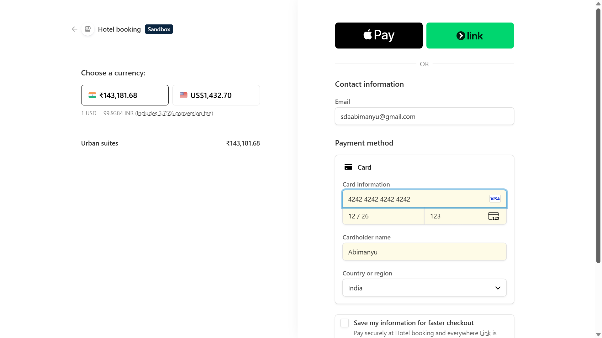
</p>

---

## 📖 My Bookings

<p align="center">
  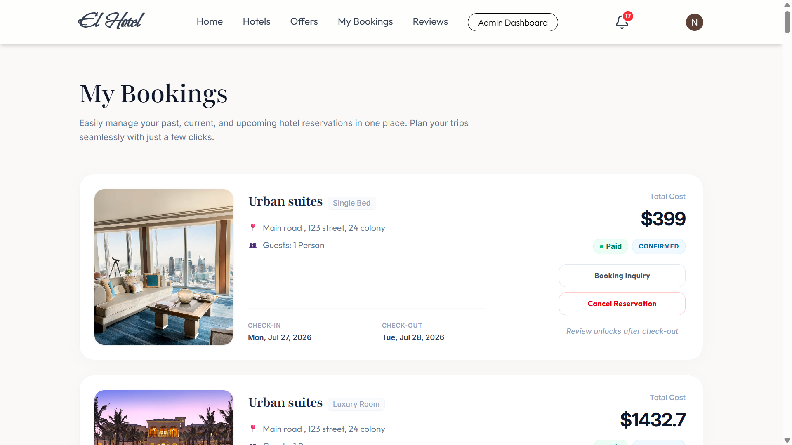
</p>

---

## 📊 Hotel Owner Dashboard

<p align="center">
  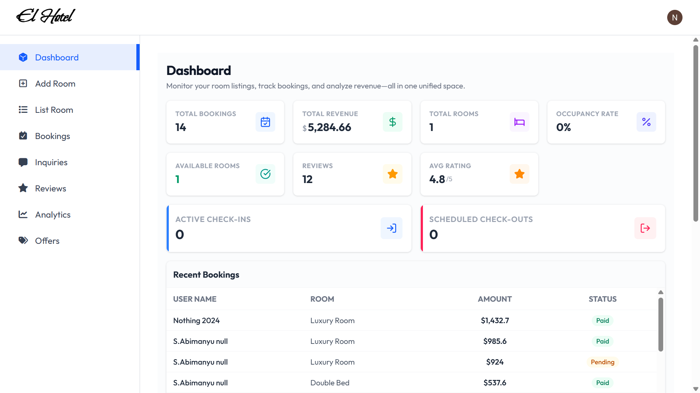
</p>

---

## 🔔 Notifications

<p align="center">
  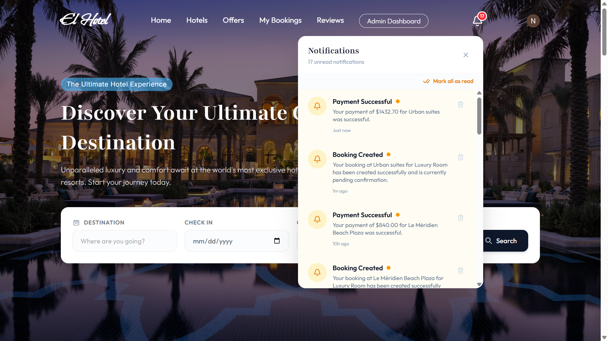
</p>

---

## 🎁 Offers

<p align="center">
  
  
</p>

---

## ⭐ Reviews & Ratings

<p align="center">
  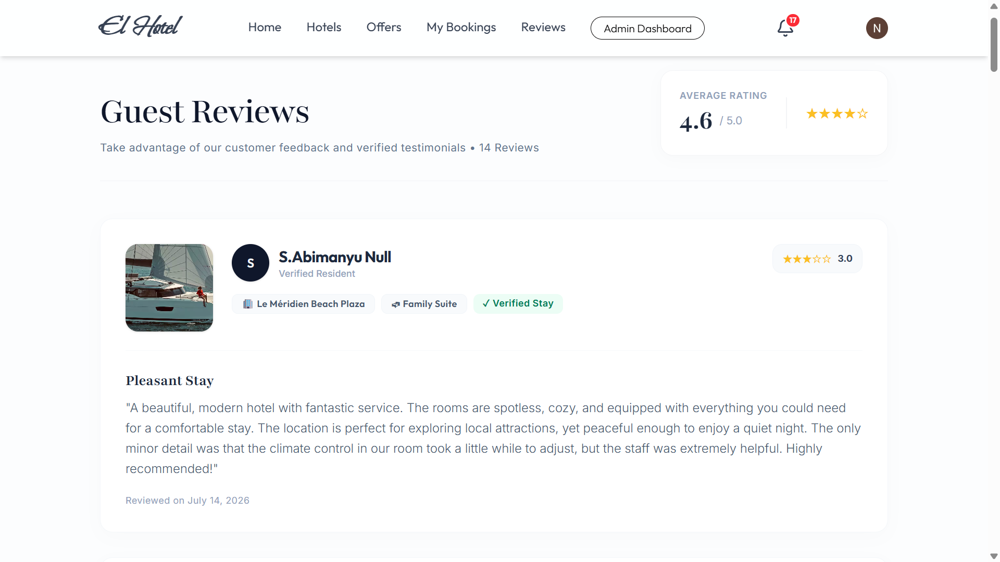
  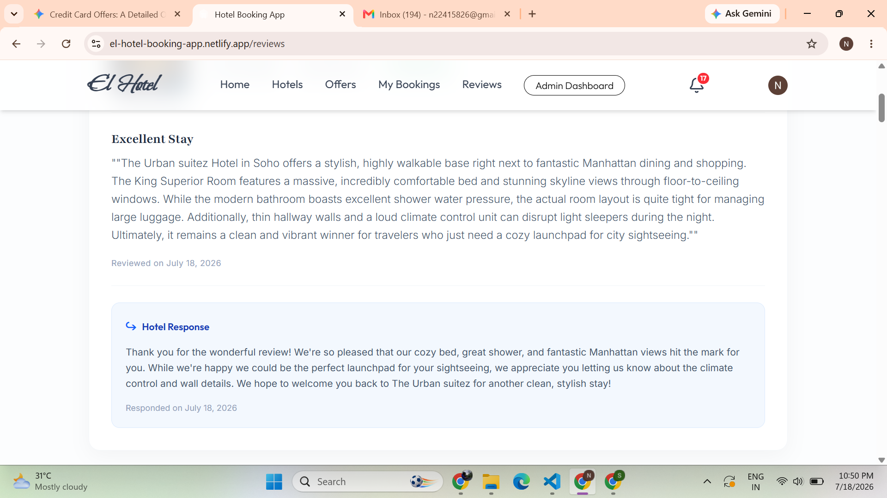
</p>


# 🚀 Deployment

Frontend

https://el-hotel-booking-app.netlify.app/

Backend

https://hotel-booking-app-5g3h.onrender.com

---

# 📌 Future Improvements

- Google Maps Integration
- Hotel Image Gallery
- Multi-language Support
- Dark Mode
- Advanced Search Filters
- Coupon Codes
- PDF Booking Invoice
- Admin Analytics Dashboard
- Real-time Chat Support

---

# 👨‍💻 Author

**Abimanyu S**

GitHub

https://github.com/sdaabimanyu

---

# 🙏 Acknowledgements

- React
- Express
- MongoDB
- Clerk
- Stripe
- Nodemailer
- Tailwind CSS
- Render
- Netlify

---

# ⭐ Support

If you like this project,

⭐ Star this repository on GitHub.

---

## 📄 License

This project was developed as a full-stack portfolio project to demonstrate modern MERN stack development, secure authentication, payment integration, and deployment practices.
